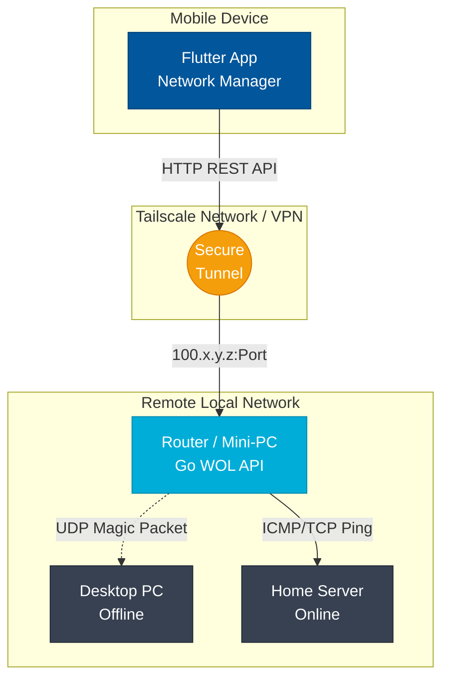
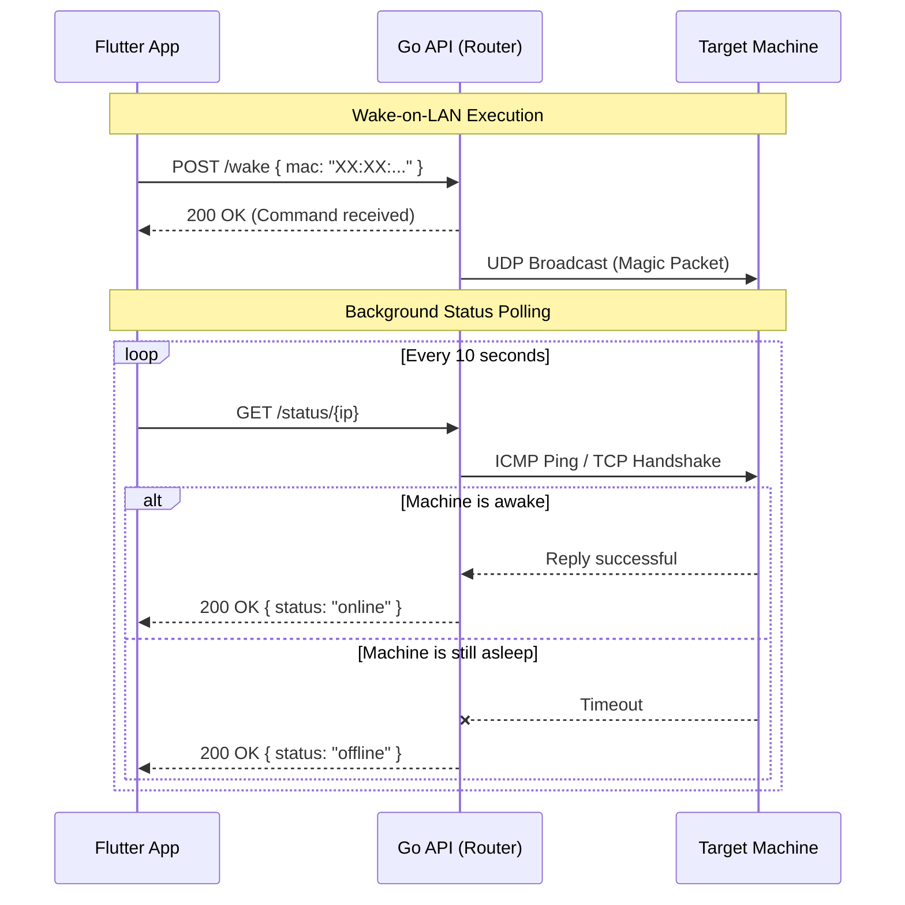
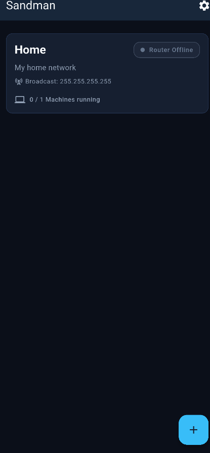
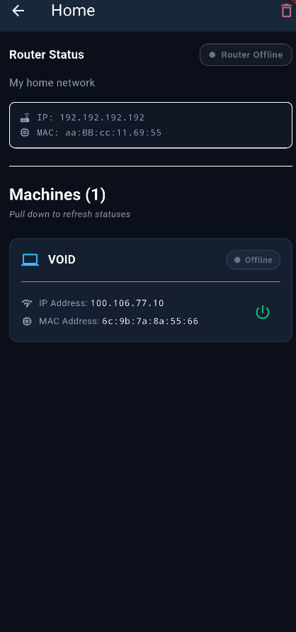
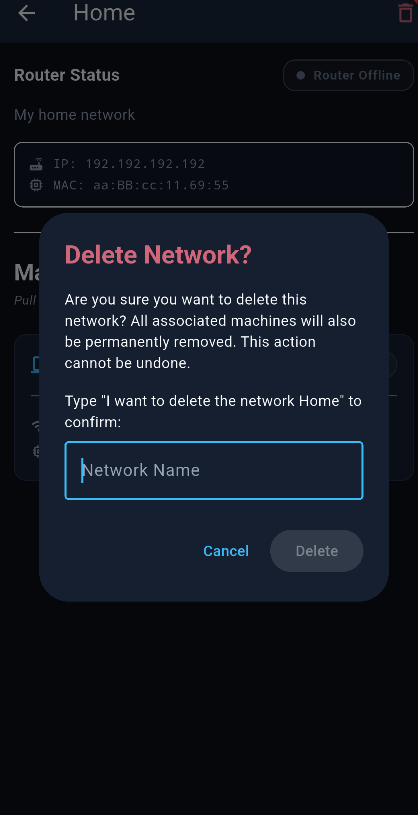

<div align="center">
  <h1>💤 Sandman</h1>
  <p><b>Your ultimate remote machine manager. Wake, monitor, and sleep your local networks safely from anywhere.</b></p>

  <!-- Badges -->
  <a href="https://flutter.dev"></a>
  <a href="https://go.dev/"></a>
  <a href="https://tailscale.com/"></a>
  <a href="https://opensource.org/licenses/MIT"></a>
</div>

---

## Project Overview
**Sandman** is a comprehensive solution designed for IT administrators and power users who need to manage multiple local networks remotely. 

Rather than exposing dangerous ports to the public internet, Sandman relies on a secure **Tailscale VPN tunnel**. It communicates with a lightweight, custom **Go API** deployed on local routers (or mini-PCs like Raspberry Pis) to trigger Wake-on-LAN magic packets and safely check the status of offline or sleeping machines.

## Key Features
- **Multi-Network Management**: Easily organize and switch between different environments (e.g., Home, Office, Sandbox).
- **Real-Time Status Polling**: Instantly see if a machine is *Online*, *Offline*, or *Waking up*.
- **Secure Wake-on-LAN (WOL) & Shutdown**: Send power commands without ever exposing your home/office network to the public web.
- **Dynamic & Responsive UI**: Built with modern Flutter (Material 3), featuring robust safety mechanisms like swipe-to-delete with Undo actions and strict text confirmations for destructive network deletions.
- **Offline Persistence**: All network and machine data is stored locally on the device using a high-performance SQLite database (Drift).

## Tech Stack
- **Frontend (Mobile)**: [Flutter](https://flutter.dev/) & Dart
- **Backend (Router Agent)**: [Go (Golang)](https://go.dev/)
- **Secure Networking**: [Tailscale](https://tailscale.com/)
- **Local Persistence**: [Drift (SQLite)](https://drift.simonbinder.eu/)

---

## System Architecture
The following diagram illustrates how the Flutter App securely communicates with the remote networks via Tailscale.



## App Flow / Sequence Diagram
Here is the sequence representing a typical Wake-on-LAN execution combined with background status polling.



---

## Prerequisites
Before you begin, ensure you have the following requirements met:
- The [Flutter SDK](https://docs.flutter.dev/get-started/install) installed on your development machine.
- The [Go Compiler](https://go.dev/doc/install) installed (to build the router API).
- A [Tailscale](https://tailscale.com/) account with devices successfully connected to your tailnet.
- A Router, Mini-PC (e.g., Raspberry Pi), or NAS inside the target LAN capable of remaining permanently online and running the compiled Go binary.

## Installation & Setup

### 1. Backend (Go API on the Router)
The backend service must be running on a machine that stays awake inside your local network.

1. Navigate to the Go API directory (assuming it is hosted in the same repository or a sub-folder).
2. Cross-compile the binary for your specific router architecture. For example, if your router is an ARM64 Linux machine:
   ```bash
   env GOOS=linux GOARCH=arm64 go build -o wol_api
   ```
3. Transfer the `wol_api` binary to your router (via `scp` or `sftp`).
4. Set it up to run as a background service. On most modern Linux systems using `systemd`, create a file at `/etc/systemd/system/wol_api.service`:
   ```ini
   [Unit]
   Description=Sandman WOL API Service
   After=network.target

   [Service]
   ExecStart=/path/to/wol_api
   Restart=always
   User=root

   [Install]
   WantedBy=multi-user.target
   ```
5. Enable and start the service:
   ```bash
   sudo systemctl enable wol_api
   sudo systemctl start wol_api
   ```

### 2. Frontend (Flutter App)
1. Clone the repository and navigate to the flutter project root.
2. Install the required Flutter dependencies:
   ```bash
   flutter pub get
   ```
3. Generate the required Drift SQLite schemas:
   ```bash
   dart run build_runner build --delete-conflicting-outputs
   ```
4. Run the app on your preferred device or emulator:
   ```bash
   flutter run
   ```

---

## Usage Guide
1. **Connect your Phone**: Ensure the Tailscale VPN app is active on your mobile device.
2. **Create a Network**: Open **Sandman**, tap the `+` Floating Action Button on the main menu to create a new network.
3. **Configure Router Details**: Input the Tailscale IP of your router (e.g., `100.x.x.x`) and the port where you deployed the Go API.
4. **Add Machines**: Input the Name, local IP, and MAC address of the machines you want to wake. The Broadcast Address will default to `255.255.255.255` but can be adjusted if your subnet differs.
5. **Control**: Tap the Power Button on a machine card. It will instantly dispatch the magic packet through the secure tunnel to the router, which broadcasts it locally!

---

## Screenshots

| Main Menu | Network Details | Safety Deletion |
| :---: | :---: | :---: |
|  |  |  |

---